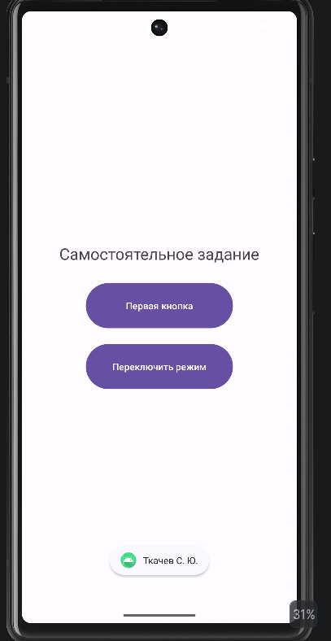

<div align="center">

# Отчёт

</div>

<div align="center">

## Практическая работа №3

</div>

<div align="center">

## Обработка событий клика

</div>

**Выполнил:**  
Ткачев Сергей Юрьевич  
**Курс:** 2  
**Группа:** ИНС-б-о-24-2  
**Направление:** ИПИНЖ (Институт перспективной инженерии)  
**Профиль:** Информационные системы и технологии  

---

### Цель работы

Изучить механизм обработки событий в Android. Научиться обрабатывать нажатия на элементы интерфейса (кнопки) с помощью декларативного подхода (XML) и программного подхода (Java). Освоить работу с идентификаторами ресурсов и `Toast`-уведомлениями.

### Ход работы

#### Задание 1: Создание проекта и вёрстка экрана

1. Было открыто Android Studio и создан новый проект с шаблоном **Empty Views Activity**. Проекту было дано имя `ClickProcessingLab`.
2. Открыт файл `activity_main.xml`. Существующий `TextView` был обёрнут в `LinearLayout` с вертикальной ориентацией (`orientation="vertical"`).
3. Под стандартным `TextView` была добавлена кнопка со следующими параметрами:

```xml
<Button
    android:id="@+id/button1"
    android:layout_width="175dp"
    android:layout_height="75dp"
    android:text="Кнопка" />
```

<div align="center">


*Рисунок 1. Результат задания 1*

</div>

#### Задание 2: Обработка клика через XML-атрибут `onClick` (декларативный подход)

1. В файле `activity_main.xml` к кнопке был добавлен атрибут `android:onClick`.

<div align="center">


*Рисунок 2. Атрибут `onClick` в XML-разметке*

</div>

2. В файле `MainActivity.java` был создан метод с именем `onButtonClick`, который соответствует сигнатуре, требуемой для обработчика кликов. Внутрь метода был добавлен показ всплывающего сообщения `Toast`.

#### Листинг 1. Метод `onButtonClick`

```java
public void onButtonClick(View v) {
    Toast.makeText(this, "Клик обработан через XML!", Toast.LENGTH_SHORT).show();
}
```

<div align="center">


*Рисунок 3. Метод `onButtonClick` в `MainActivity.java`*

</div>

3. Приложение было запущено. При нажатии на кнопку стало появляться всплывающее сообщение.

<div align="center">


*Рисунок 4. Результат задания 2*

</div>

#### Задание 3: Обработка клика через `setOnClickListener` (программный подход)

1. Атрибут `android:onClick` был удалён из XML-разметки кнопки.
2. В методе `onCreate()` файла `MainActivity.java` была получена ссылка на кнопку по её идентификатору и установлен слушатель событий.

#### Листинг 2. Обновлённый метод `onCreate`

```java
@Override
protected void onCreate(Bundle savedInstanceState) {
    super.onCreate(savedInstanceState);
    EdgeToEdge.enable(this);
    setContentView(R.layout.activity_main);

    ViewCompat.setOnApplyWindowInsetsListener(findViewById(R.id.main), (v, insets) -> {
        Insets systemBars = insets.getInsets(WindowInsetsCompat.Type.systemBars());
        v.setPadding(systemBars.left, systemBars.top, systemBars.right, systemBars.bottom);
        return insets;
    });

    Button myButton = findViewById(R.id.button1);
    myButton.setOnClickListener(new View.OnClickListener() {
        @Override
        public void onClick(View v) {
            Toast.makeText(MainActivity.this, "Клик обработан в коде!", Toast.LENGTH_SHORT).show();
        }
    });
}
```

<div align="center">


*Рисунок 5. Результат задания 3*

</div>

#### Задание 4: Использование аргумента `View` для изменения нажатой кнопки

В следующем задании был модифицирован код из задания 3: внутри метода `onClick()` изменён текст самой нажатой кнопки.

#### Листинг 3. Модифицированный обработчик клика

```java
myButton.setOnClickListener(new View.OnClickListener() {
    @Override
    public void onClick(View v) {
        Button clickedButton = (Button) v;
        clickedButton.setText("Нажата!");
        Toast.makeText(MainActivity.this, "Клик обработан в коде!", Toast.LENGTH_SHORT).show();
    }
});
```

<div align="center">


*Рисунок 6. Результат задания 4*

</div>

#### Задание 5: Работа с несколькими кнопками

1. В `activity_main.xml` были добавлены ещё две кнопки, которым присвоены уникальные идентификаторы: `@+id/button2` и `@+id/button3`.

#### Листинг 4. Кнопки в `activity_main.xml`

```xml
<Button
    android:id="@+id/button1"
    android:layout_width="175dp"
    android:layout_height="75dp"
    android:text="Кнопка 1" />

<Button
    android:id="@+id/button2"
    android:layout_width="175dp"
    android:layout_height="75dp"
    android:text="Кнопка 2" />

<Button
    android:id="@+id/button3"
    android:layout_width="175dp"
    android:layout_height="75dp"
    android:text="Кнопка 3" />
```

2. В методе `onCreate()` были получены ссылки на все три кнопки и каждой назначен свой отдельный слушатель.

#### Листинг 5. Обработчики кнопок в `MainActivity.java`

```java
Button button1 = findViewById(R.id.button1);
Button button2 = findViewById(R.id.button2);
Button button3 = findViewById(R.id.button3);

button1.setOnClickListener(new View.OnClickListener() {
    @Override
    public void onClick(View v) {
        ((Button) v).setText("Нажата кнопка 1");
        Toast.makeText(MainActivity.this, "Нажата кнопка 1", Toast.LENGTH_SHORT).show();
    }
});

button2.setOnClickListener(new View.OnClickListener() {
    @Override
    public void onClick(View v) {
        ((Button) v).setText("Нажата кнопка 2");
        Toast.makeText(MainActivity.this, "Нажата кнопка 2", Toast.LENGTH_SHORT).show();
    }
});

button3.setOnClickListener(new View.OnClickListener() {
    @Override
    public void onClick(View v) {
        ((Button) v).setText("Нажата кнопка 3");
        Toast.makeText(MainActivity.this, "Нажата кнопка 3", Toast.LENGTH_SHORT).show();
    }
});
```

3. Для наглядности выравнивание `LinearLayout` было установлено по центру.

<div align="center">


*Рисунок 7. Результат задания 5 (нажатие на вторую кнопку)*

</div>

#### Задание для самостоятельного выполнения

1. **Фамилия при клике.** Приложение из задания 2 было модифицировано так, чтобы при нажатии на кнопку на экране отображался `Toast` с фамилией и инициалами.
2. **Изменение текста кнопки.** Была добавлена вторая кнопка. Реализовано так, что при нажатии на эту кнопку текст на ней же меняется на фамилию.
3. **Три кнопки и три события.** Были созданы три кнопки. Для каждой кнопки назначен отдельный слушатель. При нажатии на любую из кнопок `Toast` выводит фамилию с указанием, какая именно кнопка была нажата.
4. **Три кнопки и один слушатель.** Выполнено задание с тремя кнопками, используя один общий объект-слушатель и проверяя `v.getId()` для идентификации нажатой кнопки.
5. **Переключение реакции.** Было создано новое приложение с двумя кнопками. Реализована логика, при которой нажатие на первую кнопку включает «режим А» (показывается `Toast` с фамилией), а нажатие на вторую кнопку переключает в «режим Б» (при нажатии на первую кнопку `Toast` показывает номер группы).

<div align="center">



*Рисунок 8. Результат самостоятельного задания*

</div>

### Вывод

В результате выполнения практической работы был изучен механизм обработки событий в Android. Были получены навыки обработки нажатий на элементы интерфейса с помощью декларативного подхода через XML-атрибут `onClick` и программного подхода через `setOnClickListener`. Также была освоена работа с идентификаторами ресурсов, объектом `View`, анонимными внутренними классами и всплывающими уведомлениями `Toast`. Практическая работа позволила закрепить навыки организации реакции интерфейса на действия пользователя.

### Ответы на контрольные вопросы

1. **Что такое ViewBinding и в чём его преимущество перед `findViewById()`?**  

   `ViewBinding` — это механизм генерации специального класса-привязки, который содержит прямые ссылки на все элементы интерфейса с `id` из XML-разметки. Вместо ручного поиска элементов через `findViewById()` разработчик получает доступ к ним через объект привязки.

   **Преимущества `ViewBinding`:**
   - безопасность типов, так как не требуется приведение типов;
   - снижение вероятности ошибок `NullPointerException`;
   - более удобный и читаемый код;
   - автодополнение элементов интерфейса в среде разработки.

   **Подключение `ViewBinding`:**

   ```gradle
   android {
       buildFeatures {
           viewBinding true
       }
   }
   ```

2. **В чём разница между декларативной (`android:onClick`) и программной (`setOnClickListener`) подпиской на событие? Когда какой способ предпочтительнее?**  

   Декларативный подход через `android:onClick` задаётся прямо в XML-разметке. Он прост и удобен в случаях, когда требуется обработать простое действие одной кнопки. Однако метод-обработчик должен находиться в `Activity`, быть `public` и иметь строгую сигнатуру.

   Программный подход через `setOnClickListener` задаётся в Java-коде. Он более гибкий, так как позволяет:
   - динамически назначать обработчики;
   - использовать разную логику для разных элементов;
   - применять один общий слушатель для нескольких кнопок;
   - изменять поведение интерфейса во время выполнения программы.

   Декларативный способ удобен для простых случаев, программный — для более сложной и гибкой логики.

3. **Что произойдёт, если в методе-обработчике, указанном в XML, изменить сигнатуру (например, убрать параметр `View v`)? Почему?**  

   В этом случае приложение завершится с ошибкой при попытке вызвать обработчик. Это произойдёт потому, что Android ищет метод обработчика через механизм рефлексии и ожидает строго определённую сигнатуру:

   ```java
   public void methodName(View v)
   ```

   Если сигнатура не совпадает, например отсутствует параметр `View`, метод имеет другой тип возвращаемого значения или не является `public`, система не сможет найти и вызвать его, из-за чего возникнет исключение.

4. **Опишите жизненный цикл `Activity`. В каком методе (`onCreate`, `onStart`, `onResume`) лучше всего инициализировать слушатели для кнопок и почему?**  

   Основные этапы жизненного цикла `Activity`:
   - `onCreate()` — создание `Activity`;
   - `onStart()` — `Activity` становится видимой;
   - `onResume()` — `Activity` переходит в активное состояние;
   - `onPause()` — `Activity` частично теряет фокус;
   - `onStop()` — `Activity` перестаёт быть видимой;
   - `onDestroy()` — уничтожение `Activity`.

   Слушатели для кнопок лучше всего инициализировать в `onCreate()`, потому что этот метод вызывается один раз при создании `Activity`. После вызова `setContentView()` интерфейс уже доступен, и можно безопасно получить ссылки на элементы и назначить им обработчики. Это позволяет избежать повторной инициализации при каждом возвращении к экрану.

5. **Что такое анонимный внутренний класс? Как он используется при установке слушателей событий в Java?**  

   Анонимный внутренний класс — это класс без имени, который объявляется и создаётся в одном месте, обычно для однократного использования. В Java он часто применяется при реализации интерфейсов, например `View.OnClickListener`.

   При установке слушателя кнопки это выглядит так:

   ```java
   myButton.setOnClickListener(new View.OnClickListener() {
       @Override
       public void onClick(View v) {
           Toast.makeText(MainActivity.this, "Кнопка нажата", Toast.LENGTH_SHORT).show();
       }
   });
   ```

   Такой способ удобен, когда логика обработчика небольшая и нет необходимости создавать отдельный именованный класс.
